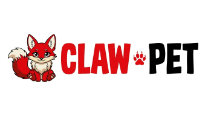

<div align="center">
  

  # EXFOLIATE! EXFOLIATE!

  
  
  

  # ClawPet — Virtual Companion for OpenClaw

  **Hatch and raise your own ASCII pet with unique traits, personality, and abilities. Your companion grows stronger as you use OpenClaw, creating a living bond between you and your AI assistant.**
</div>

## Features

- 🥚 **Deterministic Generation**: Your companion is uniquely generated from your API key using seeded PRNG
- 🎨 **Unique Traits**: Each pet has randomly generated species, personality, stats, rarity, and appearance
- ✨ **Shiny Variants**: Rare shiny pets with special visual effects (1% chance)
- 📊 **RPG-Style Stats**: STR, DEX, CON, INT, WIS, CHA affect combat performance
- ⚔️ **Combat System**: Battle other companions with D20-based attack/defense rolls
- 📈 **Leveling System**: Your pet grows stronger as you use OpenClaw (based on token usage)
- 💚 **HP/MP System**: Health and mana regenerate over time
- 🔒 **Save Integrity**: HMAC-SHA256 cryptographic protection prevents tampering

## Installation

ClawPet is included in the OpenClaw extensions directory. To enable it:

```bash
# Navigate to OpenClaw workspace
cd ~/.openclaw/workspace

# The extension is already in extensions/clawpet
# OpenClaw will auto-load it on next restart
```

## Quick Start

### 1. Hatch Your Companion

```bash
/hatch
```

Your first companion will be created! Each machine/API key can only hatch one companion to ensure uniqueness.

### 2. Check Your Pet

```bash
/pet
```

View your companion's current stats, level, HP/MP, combat abilities, and appearance.

### 3. Battle (Optional)

```bash
/attack self          # Test combat against yourself
/attack <machine-id>  # Battle another companion
```

Combat uses D20 rolls + stat bonuses. Critical hits (nat 20) deal double damage!

## AI Integration

ClawPet provides three tools that the AI can invoke automatically:

- **clawpet_hatch**: When user says "hatch", "孵化", or wants to create a pet
- **clawpet_pet**: When user says "pet", "宠物", or wants to check their companion
- **clawpet_attack**: When user wants to battle or engage in combat

The AI will detect these commands in natural language and execute them for you.

## How It Works

### Deterministic Generation

Your companion's traits (species, stats, rarity, appearance) are generated using a seeded PRNG based on your API key. This means:
- Same API key = same companion bones (species, stats, base traits)
- Portable across machines with the same API key
- Impossible to "reroll" for better stats

### Soul & Bones Architecture

- **Bones** (deterministic): Species, stats, rarity, appearance - generated from API key
- **Soul** (dynamic): Name, personality, level, HP/MP, tokens used - stored in save files

This design ensures your companion's core identity is permanent while allowing growth over time.

### Leveling & Growth

Your companion levels up as you use OpenClaw:
- Tokens used are tracked via the `llm_output` event
- Every 10,000 tokens = 1 level
- Stats increase automatically with level
- Max HP/MP scale with CON and INT stats

### Save Files

Save files are stored in `~/.openclaw/workspace/.clawpet/<machine-id>.json` with:
- Version field for future compatibility
- HMAC-SHA256 integrity checking using API key + internal salt
- Simple checksum as decoy protection
- Timestamp validation to prevent time manipulation
- Reasonableness checks to detect impossible token counts

### Combat System

Combat follows D&D-inspired mechanics:
- **Attack Roll**: d20 + DEX bonus + level
- **Defense Roll**: d20 + (WIS+DEX)/2 bonus + level
- **Damage**: Base damage (STR + level) × critical multiplier ± variance
- **Critical Hit**: Nat 20 = 2× damage
- **Critical Miss**: Nat 1 = automatic miss
- **Cooldown**: 30 seconds between attacks to prevent spam

HP regenerates 5% per minute, MP regenerates 10% per minute.

## File Structure

```
clawpet/
├── index.ts                    # Plugin entry point
├── package.json                # NPM package metadata
├── openclaw.plugin.json        # OpenClaw plugin config
├── README.md                   # This file
└── src/
    ├── types.ts                # Type definitions
    ├── storage.ts              # Save file handling with HMAC
    ├── machine-id.ts           # Machine ID from API key
    ├── openclaw-config.ts      # Read OpenClaw config
    ├── prng.ts                 # Seeded random number generator
    ├── companion.ts            # Companion generation & merging
    ├── sprites.ts              # ASCII art rendering
    ├── combat.ts               # Combat system
    ├── utils.ts                # Utility functions
    └── commands/
        ├── hatch.ts            # /hatch command
        ├── pet.ts              # /pet command
        └── attack.ts           # /attack command
```

## Development

```bash
# Build TypeScript
npm run build

# Watch mode for development
npm run dev
```

## Configuration

ClawPet has no user-configurable settings. All behavior is deterministic based on:
- Your API key (for companion generation)
- Token usage (for leveling)
- Save file state (for HP/MP/level)

## FAQ

**Q: Can I have multiple companions?**
A: No, each machine/API key can only hatch one companion. This ensures uniqueness and prevents "rerolling."

**Q: What if I change my API key?**
A: Your companion's bones (species, stats) will change because they're derived from the API key. The save file will be separate.

**Q: Can I edit my save file to cheat?**
A: No, save files have HMAC-SHA256 integrity checking. Tampering will cause the save to be rejected.

**Q: How do I reset my companion?**
A: Delete the save file at `~/.openclaw/workspace/.clawpet/<machine-id>.json` and run `/hatch` again. Note: you'll get the same bones (species/stats) because they're deterministic.

**Q: Why can't I change my companion's name?**
A: Name and personality are part of the companion's soul and can only be set at hatching. This prevents identity confusion.

## License

MIT License - see LICENSE file for details.

## Credits

Created for OpenClaw by the ClawPet team. Inspired by Tamagotchi, Pokémon, and D&D mechanics.

🐾 Happy adventuring with your companion!
